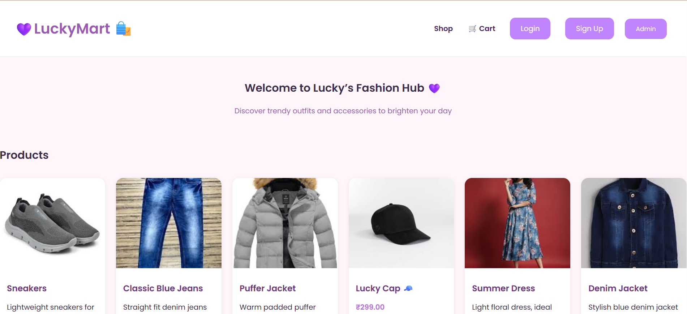
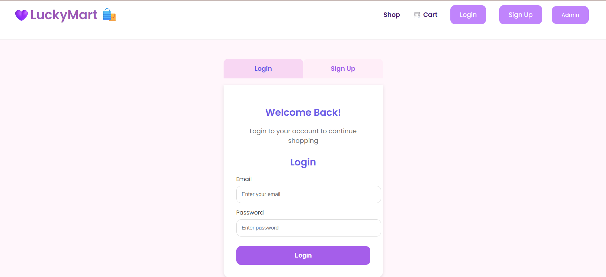
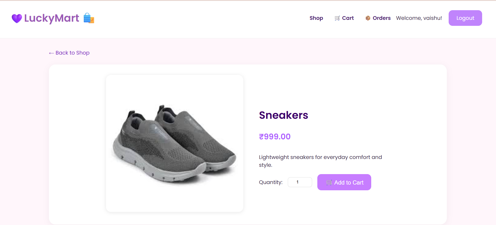

🛍 CodeAlpha Task - E-Commerce Website

A modern and responsive E-Commerce Web Application built using Django for the backend and HTML, CSS, JavaScript for the frontend.
This project is developed as part of the CodeAlpha Internship Program, showcasing real-world web development skills — from frontend design to backend integration with SQL.

---
SAMPLE PICS
Home 

Login page

Product Details

💫 Features

🛒 Customer Features

User Registration & Login System

Secure authentication

Password validation (minimum 6 chars, 1 special char, 2 numbers)

Product Listings

Browse trendy fashion items and accessories

Product images, prices, and descriptions

Product Detail View

Detailed info page for each product

Quantity selector and add-to-cart button

Cart Management

Add, remove, and view selected products

Checkout System

View total, confirm, and simulate payment

My Orders Page

See your previous orders

Option to cancel paid orders

Logout Functionality

🧑‍💼 Admin Features

Secure Django Admin Panel

Add / Edit / Delete Products

Manage Orders and Users

Product image upload support

---

💻 Tech Stack

Layer	Technology Used

Frontend	HTML5, CSS3, JavaScript
Backend	Django 5.2 (Python 3.10)
Database	MySQL
Version Control	Git & GitHub
Deployment (Optional)	Localhost / PythonAnywhere / Render
IDE	VS Code

---

⚙ Project Structure

Codealpha_Task_Ecommerce/
│
├── ecommerce/                # Main project settings
│   ├── settings.py
│   ├── urls.py
│   ├── wsgi.py
│   └── asgi.py
│
├── store/                    # Core application
│   ├── migrations/
│   ├── static/
│   │   ├── store/
│   │   │   ├── css/
│   │   │   │   └── styles.css
│   │   │   └── images/
│   ├── templates/
│   │   └── store/
│   │       ├── base.html
│   │       ├── product_list.html
│   │       ├── product_detail.html
│   │       ├── cart.html
│   │       ├── checkout.html
│   │       ├── my_orders.html
│   │       ├── signup.html
│   │       ├── login.html
│   │       └── logged_out.html
│   ├── models.py
│   ├── views.py
│   ├── urls.py
│   ├── forms.py
│   └── context_processors.py
│
├── media/                    # Product images (auto-created)
├── staticfiles/              # Collected static files
├── manage.py
└── README.md

---

🧩 Installation Guide

Follow these steps to set up and run the project on your local machine:

1️⃣ Clone this repository

git clone https://github.com/lucky24004/Codealpha_Task_Ecommerce.git
cd Codealpha_Task_Ecommerce

2️⃣ Create a virtual environment

python -m venv venv
venv\Scripts\activate

3️⃣ Install dependencies

pip install -r requirements.txt

4️⃣ Configure your database

Open ecommerce/settings.py and update your MySQL details:

DATABASES = {
    'default': {
        'ENGINE': 'django.db.backends.mysql',
        'NAME': 'ecommerce_db',
        'USER': 'root',
        'PASSWORD': 'yourpassword',
        'HOST': '127.0.0.1',
        'PORT': '3306',
    }
}

Then apply migrations:

python manage.py makemigrations
python manage.py migrate

5️⃣ Create a superuser (admin)

python manage.py createsuperuser

6️⃣ Run the development server

python manage.py runserver

Now open your browser and visit 👉
http://127.0.0.1:8000/

---

🎨 UI Highlights

Elegant and minimal interface

Pastel color palette (pink & lavender tones)

Responsive grid layout for products

Clean and modern card-based design

---

📦 Requirements.txt Example

If you don’t already have one, create requirements.txt with:

Django==5.2.6
mysqlclient==2.2.4
Pillow==10.3.0

You can generate it automatically using:

pip freeze > requirements.txt

---

🧠 Future Enhancements

Online payment integration (Razorpay / Stripe)

Product search and filters

Wishlist feature

Order tracking system

REST API for mobile version

---

👨‍💻 Developer Info

Name: Lucky 💜
Internship: CodeAlpha — Web Development Internship
Role: Full Stack Django Developer
GitHub: @lucky24004

---

🌟 Project Summary

This eCommerce system demonstrates practical implementation of:

Django’s MVC architecture

SQL integration for persistent storage

Session-based cart logic

Dynamic template rendering

User authentication & authorization

Clean, responsive frontend design
